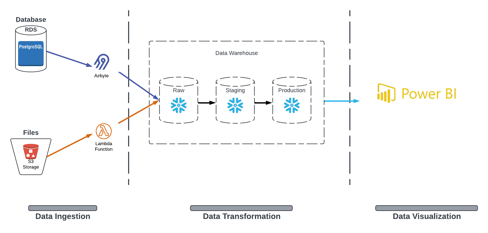
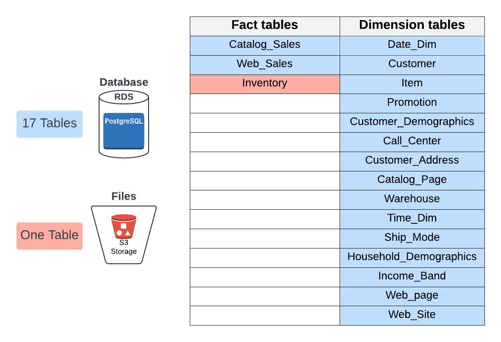
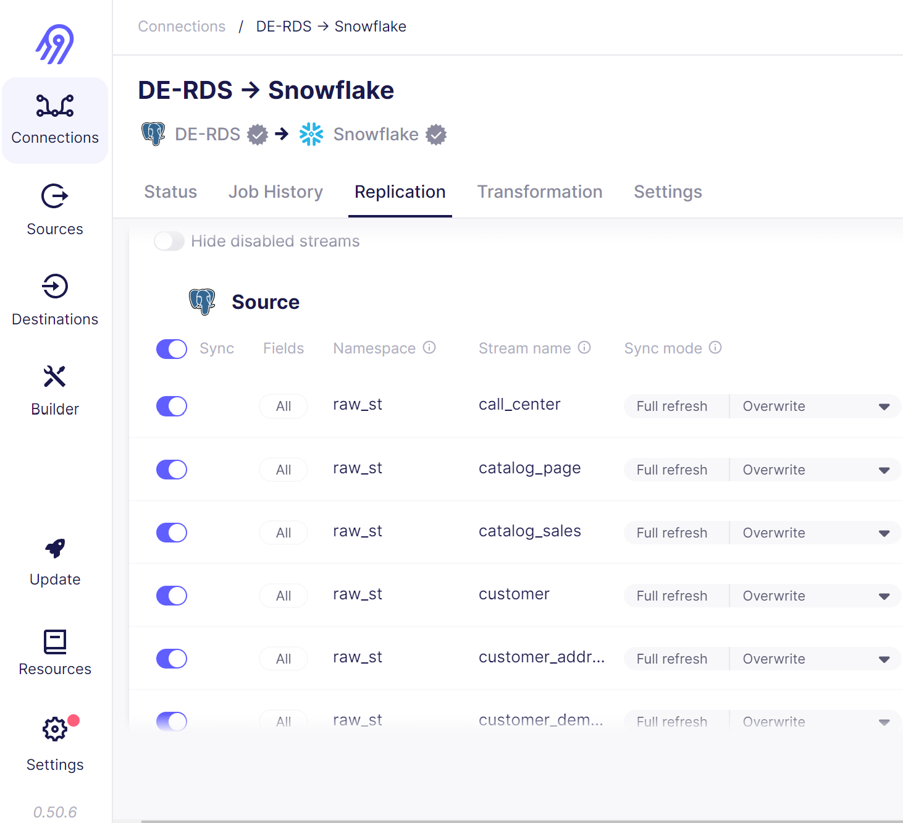

## Project Overview
This project involves typical analytical data engineering processes, starting with the ingestion of data from various sources and loading it into the Snowflake data warehouse. Within Snowflake, the data undergoes a series of transformations to prepare it for Business Intelligence (BI) purposes. The BI tool Power BI connects to the data warehouse to generate diverse dashboards and reports.

## Data Overview

The dataset utilized originates from TPCDS, a well-known dataset designed for database testing, with a specific emphasis on Retail Sales. It encompasses sales records from both websites and catalogs, along with detailed information on inventory levels for each item within every warehouse. Moreover, it incorporates 15 dimensional tables containing valuable information about customers, warehouses, items, and more.

#### The dataset is divided into two parts:
* **RDS:** All tables, except for the inventory tables, are stored in the Postgres DB in AWS RDS. These tables are refreshed every day with the latest sales data, requiring daily ETL processes. 

* **S3 Bucket:** The single Inventory table is stored in a S3 bucket as CSV file. Each day, a new file containing the most recent data is deposited into the S3 bucket. The inventory table typically registers data at the end of each week, leading to one entry per item per warehouse on a weekly basis.

## Snowflake Data Warehouse Requirements
In order to meet the BI requirements, we need to create new tables in the data warehouse. Here are the requirements for the new tables:

1. Combine certain raw tables, for merging various customer-related tables into a single table.
2. As all BI requirements are on a weekly basis, we establish a new fact table weekly, incorporating multiple additional metrics:
* **sum_qty_wk:** The sum of sales_quantity for this week.
* **sum_amt_wk:** The sum of sales_amount for this week.
* **sum_profit_wk:** The sum of net_profit for this week.
* **avg_qty_dy:** The average daily sales_quantity for this week (= sum_qty_wk/7).
* **inv_on_hand_qty_wk:** The item’s inventory on hand at the end of each week in all warehouses (= The inventory on hand at the end of this week).
* **wks_sply:** Weeks of supply, an estimated metric to see how many weeks the inventory can supply the sales (inv_on_hand_qty_wk/sum_qty_wk).
* **low_stock_flg_wk:** Low stock weekly flag. For example, if there is a single day `where (avg_qty_dy > 0 && (avg_qty_dy > inventory_on_hand_qty_wk))` in the week, then mark this week's flag as `True`.

## Tools
* Ingestion Tools
1. Airbyte
2. AWS Lambda Function
* Warehousing Tool
1. Snowflake
* Visualization Tool
1. Power BI

## Diving Into ETL Steps

### 1. Data Ingestion:
We need in this stage to ingest data from multiple sources into snowflake.

| Airbyte | Lambda Function |
|---------| ----------------|
|Ingest data from **`RDS (PostgreSQL)`**, Which Contains 17 tables refreshed daily with the latest sales data. | Ingest data from **`S3 Bucket`** that stores daily CSV file with the latest inventory data. |

* **AWS Lambda Function**

I Created an inventory table in Snowflake to hold the CSV inventory data that stored in S3 bucket. I Used the Python script <a href="Lambda_function/ingest_inv_to_snowflake.py">`Lambda_function/ingest_inv_to_snowflake.py`</a> to ingest the inventory data from the S3 bucket into Snowflake. For automation I used AWS CloudWatch to automates the execution of the Lambda function every day at 3:00 AM.

* **Airbyte**

The data in RDS is updated daily at 12:00 AM, And I used Airbyte to ingest data from RDS every day at 3:00 AM to ensure availability of the updated data.

